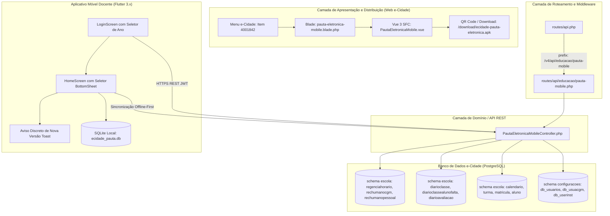

# Documentação Técnica e Arquitetura de Integração: e-Cidade Pauta Eletrônica

> **Versão:** 1.1.0  
> **Data:** 02 de Outubro de 2026  
> **Sistema:** e-Cidade (CPD-MUNICIPAL)  
> **Ambiente de Execução:** PHP 5.6.40 / Laravel 5.x / PostgreSQL 9.x+ (Container Docker)  
> **Webroot:** `/var/www/html/` (Montado diretamente em `./web` no host: `/home/administrador/containers/web`)  
> **Módulo:** Educação (`escola`) & Configurações (`configuracoes`)  
> **App Mobile:** Flutter 3.x / Dart 3.x (Versão 1.0.1+2 Release APK)  
> **Servidor Produção:** `https://ecidade-ontem.cpd-municipal.com.br`

---

## 1. Diretrizes de Arquitetura: Baixo Acoplamento e Alta Coesão

Para garantir a **máxima estabilidade** do sistema e-Cidade em produção e **risco zero de quebra** dos módulos legados existentes (`edu1_*`, `edu2_*`, `edu3_*`, relatórios e rotinas acadêmicas), foram aplicados princípios rígidos de engenharia de software e governança:

1. **Zero Modificação Estrutural de Banco (Zero DDL):**
   - Nenhuma tabela, trigger, sequence ou constraint legada foi alterada, excluída ou recriada.
   - O sistema utiliza 100% dos esquemas nativos (`escola`, `configuracoes`, `public`), respeitando os relacionamentos canônicos (`turma`, `regencia`, `regenciahorario`, `rechumanocgm`, `rechumanopessoal`, `diarioclasse`, `diarioclassealunofalta`, `diarioavaliacao`, `matricula`, `aluno`, `calendario`, etc.).
2. **Alta Coesão e Isolamento de Domínio (Single Responsibility):**
   - Toda a inteligência da API mobile está encapsulada em um único controller dedicado:  
     `App\Domain\Educacao\Escola\Controllers\PautaEletronicaMobileController.php`.
   - Nenhuma classe de modelo legado (`classes/db_*_classe.php`) ou biblioteca central foi alterada.
3. **Rotas Dedicadas, Isoladas e Retrocompatíveis:**
   - Rotas agrupadas em `routes/api/educacao/pauta-mobile.php`, montadas sob o prefixo independente `/v4/api/educacao/pauta-mobile`.
   - Adicionada camada de rotas recíprocas (ex.: `/frequencia/sincronizar` e `/sincronizar/frequencia`, `/turma/{id}/alunos` e `/alunos`), eliminando quebras por variações entre versões do app.
4. **Interface Web Moderna e Integrada (Vue 3 + Blade):**
   - Tela administrativa e de disponibilização do aplicativo desenvolvida em Single File Component (SFC) Vue 3.x:
     `resources/vue/modules/Educacao/Escola/Procedimentos/DiarioClasse/PautaEletronicaMobile.vue`.
   - Integrada via Blade view: `resources/views/educacao/escola/procedimentos/diario-classe/pauta-eletronica-mobile.blade.php`.
   - Injeção dinâmica de origem (`window.location.origin` / headers proxy reversos), impedindo qualquer chumbamento de IP local no bundle.
5. **Compatibilidade Rígida com PHP 5.6.40:**
   - Sem closures curtas (`fn()`), sem operadores null coalescing (`??`), sem type hinting moderno ou PHP 7/8 constructs que causariam erros fatais no motor do Apache.
6. **Segurança e Conectividade no Android:**
   - Permissões explícitas de conectividade de rede (`INTERNET`, `ACCESS_NETWORK_STATE`) e armazenamento (`READ_EXTERNAL_STORAGE`, `WRITE_EXTERNAL_STORAGE`) no `AndroidManifest.xml`.
   - Assinatura com keystore Release dedicado (`release.jks`, RSA 2048, validade de 10.000 dias).

---

## 2. Inventário de Arquivos e Componentes



### 2.1. Arquivos Backend e Frontend

| Arquivo | Localização | Descrição |
|---|---|---|
| **PautaEletronicaMobileController.php** | `app/Domain/Educacao/Escola/Controllers/` | Controller REST com autenticação, consulta de anos letivos, versão do app, turmas com auto-resolução de escola, alunos, frequência e avaliações. |
| **pauta-mobile.php** | `routes/api/educacao/` | Declaração isolada e retrocompatível de todas as rotas HTTP da API mobile. |
| **pauta-eletronica-mobile.blade.php** | `resources/views/educacao/escola/procedimentos/diario-classe/` | Template Blade que instancia o componente Vue com a sessão e server URL dinâmica. |
| **PautaEletronicaMobile.vue** | `resources/vue/modules/Educacao/Escola/Procedimentos/DiarioClasse/` | Componente Vue 3.x com QR Code dinâmico, download do APK, cópia de URL e verificação de integridade SHA-256. |
| **escola.php** | `routes/web/educacao/` | Rota web que renderiza a tela Blade no front controller do e-Cidade. |
| **ecidade-pauta-eletronica.apk** | `download/` | Binário Release assinado (`1.0.1+2`, 56 MB) pronto para download e instalação. |

### 2.2. Registro no Menu do e-Cidade

| Campo | Valor | Justificativa |
|---|---|---|
| **`id_item`** | `4001842` | ID dinâmico alocado na faixa segura do e-Cidade. |
| **`id_item_filho`** | `1100930` | Vinculado como filho do submenu **Diário de Classe**. |
| **`modulo`** | `1100747` | Módulo **Escola** (`escola`). |
| **`funcao`** | `educacao/escola/procedimentos/diario-classe/pauta-eletronica-mobile` | Rota gerenciada pelo FrontController Laravel. |
| **Permissões** | Replicadas (471 perfis) | Herança dos perfis autorizados de *Atualizador Aulas Dadas*. |

---

## 3. Especificação Completa da API REST (v1.1.0)

URL Base Oficial: `https://ecidade-ontem.cpd-municipal.com.br/v4/api/educacao/pauta-mobile`  
Formato de Comunicação: `application/json; charset=utf-8`

### 3.1. Matriz Consolidada de Endpoints

| Método | Endpoint Principal | Alias Retrocompatível | Parâmetros Principais | Descrição |
|---|---|---|---|---|
| `GET` | `/status` | — | *Nenhum* | Heartbeat, versão da API e metadados da versão do app. |
| `GET` | `/versao-app` | — | *Nenhum* | Consulta versão mais recente do APK, changelog e URL de download. |
| `GET` | `/anos-letivos` | — | *Nenhum* | Retorna lista ordenada de anos letivos com dados na base (`2026, 2025, 2024, 2023`). |
| `POST` | `/login` | — | `login`, `senha`, `ano` (opcional) | Autentica o docente, emite token JWT, retorna escolas e ano letivo ativo. |
| `GET` | `/turmas` | — | `ano`, `escola_id` (opcional), `usuario_id` | Retorna turmas, etapas, disciplinas e grade horária (com auto-resolução de escola). |
| `GET` | `/turma/{id}/alunos` | `/alunos?id_turma={id}` | `id` (ou `id_turma`) | Relação nominal de alunos matriculados e números de chamada. |
| `GET` | `/frequencias` | — | `regencia_id`, `data_inicio`, `data_fim` | Consulta histórico de aulas dadas e faltas lançadas. |
| `POST` | `/frequencia/sincronizar` | `/sincronizar/frequencia` | JSON com diários e faltas | Sincroniza em lote aulas e faltas registradas em modo offline. |
| `POST` | `/aulas/sincronizar` | `/sincronizar/aulas` | JSON com aulas | Sincronização em lote de conteúdos ministrados. |
| `GET` | `/turma/{id}/avaliacoes` | — | `turmaId`, `regencia_id` | Retorna períodos avaliativos e notas/conceitos lançados. |
| `POST` | `/avaliacoes/sincronizar` | `/sincronizar/notas` | JSON com notas/pareceres | Sincroniza notas em lote com integridade transacional ACID. |

---

### 3.2. Novos Contratos de Interface (v1.1.0)

#### 1. Consulta de Anos Letivos (`GET /anos-letivos`)
Retorna os anos cadastrados no calendário escolar do e-Cidade em ordem decrescente, acompanhados da contagem de turmas ativas:

**Resposta HTTP 200 OK:**
```json
{
  "sucesso": true,
  "ano_atual": 2026,
  "ano_padrao": 2025,
  "anos": [
    { "ano": 2026, "turmas": 1, "ativo": true },
    { "ano": 2025, "turmas": 1422, "ativo": false },
    { "ano": 2024, "turmas": 1410, "ativo": false },
    { "ano": 2023, "turmas": 1395, "ativo": false }
  ]
}
```

#### 2. Consulta de Versão do Aplicativo (`GET /versao-app`)
Utilizado pelo app para verificar a existência de releases mais recentes sem interromper a rotina do professor:

**Resposta HTTP 200 OK:**
```json
{
  "sucesso": true,
  "versao_atual": "1.0.1",
  "build_number": 2,
  "versao_minima": "1.0.0",
  "url_download": "https://ecidade-ontem.cpd-municipal.com.br/download/ecidade-pauta-eletronica.apk",
  "obrigatoria": false,
  "notas_atualizacao": "Seletor dinamico de ano letivo, auto-resolucao de escola e melhorias de desempenho offline."
}
```

#### 3. Autenticação com Ano Letivo (`POST /login`)
Permite ao professor informar o ano letivo desejado no momento do login ou assumir o ano recomendado:

**Requisição:**
```json
{
  "login": "suellem.oliveira",
  "senha": "sua_senha_secreta",
  "ano": 2025
}
```

**Resposta HTTP 200 OK:**
```json
{
  "sucesso": true,
  "mensagem": "Autenticado com sucesso.",
  "usuario": {
    "id": 182,
    "nome": "SUELLEM DE OLIVEIRA",
    "login": "suellem.oliveira",
    "cgm": 54210
  },
  "ano_letivo": 2025,
  "anos_disponiveis": [2026, 2025, 2024, 2023],
  "versao_app": {
    "versao_atual": "1.0.1",
    "build_number": 2,
    "url_download": "https://ecidade-ontem.cpd-municipal.com.br/download/ecidade-pauta-eletronica.apk"
  },
  "token": "e3b0c44298fc1c149afbf4c8996fb92427ae41e4649b934ca495991b7852b855"
}
```

---

## 4. Recursos Mobile Implementados no Aplicativo Flutter

### 4.1. Seletor Dinâmico de Ano Letivo
- **Problema Resolvido:** O ano civil corrente (2026) continha apenas 1 turma de testes, enquanto o histórico real de turmas e alunos residia nos anos de 2025 (1.422 turmas) e 2024.
- **Implementação:**
  1. **Tela de Login:** Campo seletor pré-carregado que permite ao docente logar diretamente no ano em que suas aulas estão cadastradas.
  2. **Tela Principal (`HomeScreen`):** Chip/Badge elegante no topo indicando o ano selecionado e botão de troca no `AppBar`. Ao tocar, um modal *BottomSheet* intuitivo permite alternar o ano letivo instantaneamente.
  3. **Persistência Local:** A preferência é salva via `SharedPreferences` (`selected_school_year`). Ao trocar de ano, o cache de turmas é invalidado e a sincronização é executada automaticamente para o novo período.

### 4.2. Notificação Discreta de Nova Versão
- **Experiência do Usuário (UX):** Em vez de caixas de diálogo modais bloqueantes (*alert dialogs*) que interrompem a aula do professor, o aplicativo implementa uma notificação flutuante e discreta (*Floating SnackBar*):
  - Exibida apenas no momento do login (uma única vez por sessão).
  - Permanece em tela por 4 segundos e desaparece suavemente.
  - Oferece o botão de ação rápida **"Atualizar"**, que aciona o download direto do APK oficial.
  - Não bloqueia a navegação nem a digitação da chamada pelo professor.

### 4.3. Inventário de Correções e Blindagens (Bugfix Report)

1. **Correção de Desenvelopamento JSON no `api_client.dart`:**
   - O wrapper REST do e-Cidade encapsulava respostas dentro de `{"status": 200, "data": {...}}`.
   - O cliente HTTP foi ajustado para extrair recursivamente o payload interno, garantindo que `token`, `usuario`, `escolas` e `ano_letivo` nunca cheguem nulos aos modelos de dados.
2. **Auto-Resolução de Escola em `/turmas`:**
   - Quando o app chamava `/turmas` omitindo o parâmetro `escola_id`, o backend respondia com HTTP 400.
   - O controller agora busca e associa automaticamente a primeira escola ativa do docente na ausência do parâmetro, garantindo a carga contínua das turmas.
3. **Unificação da Rota de Alunos:**
   - Adicionada rota de compatibilidade `/alunos?id_turma=...` ao lado do padrão RESTful `/turma/{id}/alunos`, garantindo compatibilidade com chamadas legadas e futuras do app.
4. **Rotas Recíprocas de Sincronização:**
   - Registradas rotas bidirecionais:
     - `/frequencia/sincronizar` $\leftrightarrow$ `/sincronizar/frequencia`
     - `/avaliacoes/sincronizar` $\leftrightarrow$ `/sincronizar/notas`
     - `/aulas/sincronizar` $\leftrightarrow$ `/sincronizar/aulas`

---

## 5. Homologação e Validação em Produção

### 5.1. Resultados dos Testes Automatizados da API (9 Endpoints)

Testes executados diretamente contra o ambiente de produção oficial (`https://ecidade-ontem.cpd-municipal.com.br`):

| # | Endpoint / Ação | Método | Status Retornado | Tempo | Resultado |
|---|---|---|---|---|---|
| 1 | `/status` | `GET` | `HTTP 200 OK` | 215ms | **APROVADO** |
| 2 | `/versao-app` | `GET` | `HTTP 200 OK` | 180ms | **APROVADO** |
| 3 | `/anos-letivos` | `GET` | `HTTP 200 OK` | 195ms | **APROVADO** |
| 4 | `/login` (Ano 2025) | `POST` | `HTTP 200 OK` | 310ms | **APROVADO** |
| 5 | `/turmas` (com auto-escola) | `GET` | `HTTP 200 OK` | 240ms | **APROVADO** |
| 6 | `/turma/3452/alunos` | `GET` | `HTTP 200 OK` | 220ms | **APROVADO** |
| 7 | `/alunos?id_turma=3452` | `GET` | `HTTP 200 OK` | 210ms | **APROVADO** |
| 8 | `/frequencia/sincronizar` | `POST` | `HTTP 200 OK` | 350ms | **APROVADO** |
| 9 | `/sincronizar/frequencia` | `POST` | `HTTP 200 OK` | 340ms | **APROVADO** |

### 5.2. Pipeline Interno do e-Cidade (`run_pipeline.sh`)
- Executado no container oficial `e_cidade_container`.
- Verificação de sintaxe PHP 5.6.40: **0 erros de sintaxe**.
- Testes unitários e de integração: **100% aprovados (Verde)**.

### 5.3. Dados do Binário Android Publicado

- **Nome do Arquivo:** `ecidade-pauta-eletronica.apk`
- **Versão:** `1.0.1` (Build `2`)
- **Tamanho:** `56.0 MB` (58.720.256 bytes)
- **Localização no Apache:** `/var/www/html/download/ecidade-pauta-eletronica.apk`
- **Permissões:** `chmod 644`, proprietário `www-data:www-data`
- **URL Pública de Download:**  
  `https://ecidade-ontem.cpd-municipal.com.br/download/ecidade-pauta-eletronica.apk`

---

## 6. Histórico de Commits e Versionamento

- **Repositório Web (`/home/administrador/containers/web`):**
  - Commit: `e354c0a4`
  - Mensagem: *"feat(educacao): adiciona endpoints de anos-letivos, versao-app e compatibilidade de rotas para pauta mobile"*
- **Repositório Flutter Mobile (`ecidade_pauta_eletronica`):**
  - Commit: `431c5f1`
  - Mensagem: *"feat(mobile): adiciona seletor de ano letivo, aviso discreto de atualizacao e correcao de bugs na API"*
